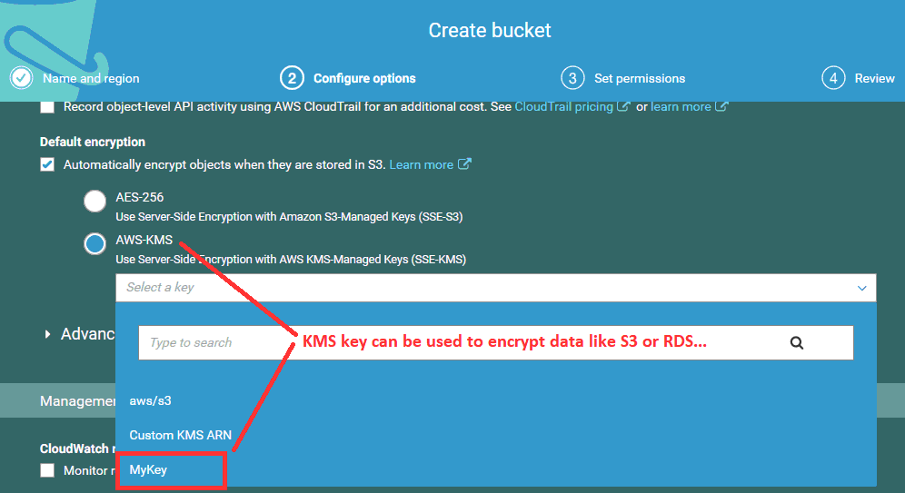

# AWS learning


Associate vs professional:   Associate exam will tell you how many correct answers in multiple choice questions, professional won’t

Need about 70% correct rate to pass, it is floating year by year
Total questions: 65
Total minutes: 130


What are the four levels of AWS premium support:
Basic, Developer, Business and Enterprise

Remember that 'Free Tier' is a billing rebate. It is not an account type or support type.

Public cloud allows organisations to try out new ideas, new approaches and experiment with little upfront commitment. If it doesn't work out, organisations have the ability to terminate the resources and stop paying for them.
Also users don’t need to deal with failure or damage

Most of AWS resources are region-specific, like EC2 Key Pairs, Security Groups, and ELBs. Route53, IAM, S3(data belongs to a region), CloudFront are global


Availability zone = 1Data center or multiple data centers which are close to each others
A region is a geographical area which consists at least 2 availability zones 
Edge location are endpoint of AWS which are used for caching, like CDN
AWS now has 19 regions, 57 AZ, 150 edge locations
AZs within a single region provide inexpensive, low latency network connectivity to other AZs in the same region. 

## S3

Storage gateway: 
+ File Gateway
+ Volume gateway, runs in either a cached or stored mode
+ Tape gateway
Cached mode Volume gateway and File Gateway retain a copy of frequently accessed data subsets locally
You can take snapshots on both mode
In the stored mode, your primary data is stored locally and your entire dataset is available for low-latency access while asynchronously backed up to AWS. In AWS side, they are many EBS incremental snapshots, you can restore them into EBS volume. 
In the cached mode, you data files are mapped to S3 objects. But you can’t  directly access them S3 objects except gateway itself.


How to link S3 web server to your web domain: 

 
By default, S3 objects are private, can only be accessed in AWS cloud or by login users
In the code, you can set user secret in `C:\Users\[USERNAME]\.aws\credentials`
```
	[default]
	aws_access_key_id=dddkkdkd
	aws_secret_access_key=sdkaddslda
```
To make it easy, AWS also provide a tool kit for Eclipse. With that tool kit, you don’t need to set that file, Also you don’t need to set it in EC2 instance

Object etag based on file content, not filename or updatedTime.

S3 replica need version, won't sync deletion operation

Amazon Athena is an interactive query service that makes it easy to analyse data in Amazon S3, using standard SQL commands. It will work with a number of data formats including "JSON", "Apache Parquet", "Apache ORC" amongst others, but "XML" is not a format that is supported.

One Zone IA still have same durability as stand S3(11X9), but availability reduced to 99% from 99.9%.  IA availability  is also 99%, the same.



### CloudFront 


CloudFront is a fast CDN service delivering data, videos, apps & APIs globally. Accelerate your website with fast downloads from Amazon S3

Does CloudFront respect HttpHeader cache setting like n-cache, cache expired?
CloudFront  respect HttpHeader cache setting when Minimum TTL = 0 Seconds.
Please see details from here:
https://docs.aws.amazon.com/AmazonCloudFront/latest/DeveloperGuide/Expiration.html


CloudFront also can link to a private S3 bucket, but access will be rejected unless you set an Origin Access Identity which is a virtual user identity that is used to give the CloudFront distribution permission to fetch a private object from an S3 bucket

## IAM

IAM(Identity and access management) : users, groups, roles, policies
IAM allows you to control how people and programs are allowed to manipulate your AWS infrastructure, not non AWS service
IAM can integrate with two different types of outside Identity Providers (IdP):
+ OpenId for federating web identities, like FaceBook...
+ SAML for federating internal identities, Like Active Directory or LDAP

IAM permits users to have no more than two active access keys at one time, it is for rotation

KMS = key management service: import your own keys, disable and re-enable keys and define key management roles in IAM.
Availability Zone names are unique per account and do not represent a fixed resource.Ie. my usa_east-1a != your usa_east-1a

Consolidated Billing is a feature of AWS Organisations. Once enabled and configured, you will receive a bill containing the costs and charges for all of the AWS accounts within the Organisation.

You can only assign a single role to an EC2 instance, so it’s concept is different from traditional role: it actually is a collection of policies. So role name should be something like webServerRole which include all policies for this web server , like S3FullAccess, RDSFullAccess…

Group is a special case of the role,  it collects policies, Role can do others like link to web identity ,SAML or other AWS account.

Every policy still have a lot of permissions on each aspect of the target service to finish the whole workflow, for example, AmazonRDSDataFullAccess include those allowed permissions:
+ DBQMS.GetQueryString, DBQMS.CreateFavoriteQuery …
+ RDS Data API:BeginTransaction ExecuteStatement ,CommitTransaction , RollbackTransaction ...

## EC2

AMI = Amazon machine instance
EC = Elastic Computing

You can only create max 20 EC2 instances in a region, but you can ask Amazon to increase the number.

EC2 has different pricing model: 
+ On demand(fixed rate by hours and power of the AMI), 
+ Reserved: a contract cover years for AMI,cost less than On demand
+ Spot instance: bid price on what you want, not guarantee you can get it or keep it
+ Dedicated instance: physical instance for your dedicated use , good for some server license
EC2 has three types of placement group:
+ Clustered, stay closely as they can, get network performance benefit
+ Spread: stay away in the same AZ, get safe benefit, can only has max 7 instances in one AZ
+ Partitioned: a mix of spread and clustered: spread a group of clustered instances 

Until very recently AWS exclusively used Xen Hypervisors, Recently they started making use of Nitro Hypervisors

In addition to choosing the correct EBS volume type for your specific task, what else can be done to increase the performance of your volume?
+ striping using RAID 0
+ choose an EC2 instance type that supports EBS optimisation
+ scheduled snapshots are carried at times of low usage for HDD

Some types of EC2 instances have an extra instance store volume(default is EBS). Instance store volumes are ephemeral, meaning that they exist ONLY in conjunction with their accompanying EC2 instance. This storage is located on disks that are physically attached to
the host computer..It also have very high IOPS. 
On the other hand, EBS is networking attached, so need EBS optimization to get dedicated throughput for guaranteed high IOPS.

To set disaster recovery for a single-region application, you need : copy AMI from source region, manually apply launch permission, user-defined tags, or Amazon S3 bucket permissions from the source AMI to the new AMI, because AWS doesn’t copy it for you
 
 You can modify your whole EC2 reservation, or just a subset, in one or more of the following ways:
+ Switch Availability Zones within the same region.
+ Change between EC2-VPC and EC2-Classic.
+ Change the instance type within the same instance family (Linux instances only).

For example:  m3.xlarge => m3.large, here m3 is type family. Without reservation, you can change to any type!


An Amazon EC2 Dedicated Host is a physical server with EC2 instance capacity fully dedicated to your use. Dedicated Hosts can help you address compliance requirements and reduce costs by allowing you to use your existing server-bound software licenses.

Dedicated Host is an enhance of Dedicated instance.

### EBS 

EBS volumes can be encrypted by Third party volume encryption tool or OS tools
Each Amazon EBS volume is automatically replicated within its Availability Zone.

You cannot change encrypt status when create a volume from a snapshot. But you can copy an unencrypted volume into an encrypted snapshot or reverse.
So this is the only way to change root volume into  encrypted status:
+ Go to root volume
+ Create a snapshot, which is unencrypted
+ Copy to a new encrypted snapshot
+ Create an AMI from the new encrypted snapshot
+ Create an instance from this AMI, stop old instance

It has another way if it is not root volume: 
+ Create a new encrypted volume and attach it 
+ Copy data into this new volume
+ Detach old data unencrypted volume
+ Reattach encrypted volume to replace mount path
Also you can share an unencrypted snapshot. But you can’t share an encrypted snapshot

The volume is created immediately when it is restored from the snapshot, but the data is loaded lazily. This means that the volume can be accessed upon creation, and if the data being requested has not yet been restored, it will be restored upon first request.
EBS snapshot is saved in S3, but you have no way to directly access them.

Snapshots occur asynchronously; the point-in-time snapshot is created immediately, but the status of the snapshot is pending until the snapshot is complete (when all of the modified blocks have been transferred to Amazon S3), which can take several hours for large initial snapshots or subsequent snapshots where many blocks have changed. While it is completing, an in-progress snapshot is not affected by ongoing reads and writes to the volume. 

AMI image is EC2 image copy, a set of EBS snapshots with OS in it. We usually use it to create duplicate EC2 instances , backup or move to another region.

### CloudWatch

CloudWatch monitors your Amazon Web Services (AWS) resources and the applications you run on AWS in real time. You can use CloudWatch to collect and track metrics, which are variables you can measure for your resources and applications. 
It can monitor not only EC2, also many other services like EBS volume, storge gateway, Autoscaling group... 

CloudWatch metric data is kept for 2 weeks.
CloudWatch offers either basic(default) or detailed monitoring for supported AWS products.
Basic monitoring sends data points to CloudWatch every five minutes for a limited
number of preselected metrics at no charge. 
Detailed monitoring sends data points to CloudWatch every minute and allows data aggregation for an additional charge

CloudTrail monitor the AWS actions AWS API calls, ignore read only API,  it is about auditing and logging
CloudTrail tracks API access for infrastructure-changing events, in S3 this means creating, deleting, and modifying bucket 
S3 Server Access Logging provides web server-style logging of access to the objects in an S3 bucket. This logging is granular to the object, includes read-only operations, and includes non-API access like static web site browsing.
CloudWatch  monitor performance, not API, not access

CloudWatch always uses SNS to send notification, it won’t send directly, so you need to create a topic in SNS or using existing one.

## DB

DB automatic backup is enabled by default, it saved the Data in S3 for free
    it will take a daily snapshot in a set time, will affect performance,
    the data can trace back in seconds before failure because it will use DB transaction logs

DB restore always create a new instance
When using automated backups, Amazon RDS combines the daily backups performed during your predefined maintenance window in conjunction with transaction logs to enable you to restore your DB Instance to any point during your retention period, typically up to the last five minutes.
All automated backup snapshots are deleted and cannot be recovered when you delete a DB Instance while manual snapshots  are not deleted.


  | Multi-AZ  | Read replica
------------ | ------------- | -------------
Main purpose | disaster recovery | improving performance 
method | synchronously | asynchronously
Can cross regions | No | Yes
Support all DB engineer | Yes | Only open source DB: MySQL, MariaDB, PostgreSQL, and Aurora
Automatically fail over | Yes | No

Multi-AZ will automatically failed over on another availability zone, the application will use DNS name to point to primary dB instance. It will automatically fail over to the second instance when primary failed. You can also perform a manual failover. Failover is fast, typically one  to two minutes. By the way, the application need to purge connection pool if it has after failover happened . 


 
Amazon ElastiCache offers fully managed Redis and Memcached. Seamlessly deploy, run, and scale popular open source compatible in-memory data stores. Redis is more powerful than Memcached
By default max 20 nodes can you add to an Amazon ElastiCache cluster running Memcached
Redis clusters can only contain a single node; however, you can group multiple
clusters together into a replication group

Amazon Aurora is a MySQL and PostgreSQL-compatible relational database built for the cloud, that combines the performance and availability of traditional enterprise databases with the simplicity and cost-effectiveness of open source databases.
Amazon Aurora is up to five times faster than standard MySQL databases and three times faster than standard PostgreSQL databases. It provides the security, availability, and reliability of commercial databases at 1/10th the cost, features a distributed, fault-tolerant, self-healing storage system

AWS RDS doesn’t include DB2 in this moment

### DynamoDB 
AWS deliver high durability for DynamoDB because it automatically replicate cross multiple AZs

There will always be a charge for provisioning read and write capacity and the storage of data within DynamoDB. There is no charge for the transfer of data into DynamoDB, providing you stay within a single region (if you cross regions, you will be charged at both ends of the transfer.)

For DynamoDB, you need to design a good partition key that will distribute IO from sequential data across partitions evenly to avoid performance bottlenecks.

You can only create one Primary Key, but you can create many global secondary indexes, which don’t need unique value not like Primary key
Without key or index, you can’t query a column, RDS can 
GSI will ignore null values, so use rare case value as key will improve performance. For example: some rows will rarely have inactive status, then column “inactive” with null value for “active” will be better than “status” with both status

DynamoDB allows for the storage of large text and binary objects, but there is a limit of 400 KB.
DynamoDB has many use cases: storing JSON data, BLOB data and storing web session data

## Security

A security group is a stateful firewall; that is, an outgoing message is remembered so that the
response is allowed through the security group without an explicit inbound rule being
Required.
Security groups are applied at the instance level, as opposed to a traditional on-premises
firewall that protects at the perimeter. This gives flexibility like allowing traffic for a set of servers across multiple subnets. In this case, your security group will be given product line name.

What is the difference between Security group(S26) and Network Access Control List(ACL) (S66)?  
    Security group control inbound , outbound port and source
SG automatically enable outbound port for enabled inbound port, ACL doesn't
Security groups are stateful which means that return traffic is automatically allowed, ACL are stateless
Security groups updates are applied immediately, ACL updates are applied near instantaneously.
Security group can't set block rule, ACL can
No SG means every inbound are blocked, so you must have at least one SG to do some real server  jobs
ACL attached to subnet, SG attached to service or instance level like EC2

Compare SG and ACL,:
+ By default, SG  block all internet requests except AWS console
+ By default, ACL allow all Internet access
+ An explicit ACL allow overrides the default
+ an explicit ACL deny overrides all allows
+ AWS processes rules in number order when deciding whether to allow traffic.


AWS manage console won’t be affected by security group ,ACL or public IP, it is only affected by IAM policies. 

Router table is similar as ACL, but it is usually on VPC level, ACL on subnet level

### Amazon EC2 multiple layers of security:

## Route53
Route 53 has the following routing policies - Simple, Weighted, Latency, Failover, Multivalue answer, Geoproximity. and Geolocation


Geolocation is based on country(independant area like Taiwan is in the list) or continent boundaries, you can set default one for unspecified Geolocation 
Geoproximity is based on Latitude & Longitude.


What are the differences between network load balance(section 73), placement group(s39), routing policy(s53)
    Route53  loading balance(play trick on domain name) vs application load balance(network) vs cloudFront(ie. CDN)

Alias Records have special functions that are not present in other DNS servers. Their main function is to provide special functionality and integration into AWS services:
Alias can also be used at the Zone Apex, where CNAME records cannot. 
CNAME record can point to any DNS record hosted anywhere, Alias can only point to AWS route53 records.
Alias Records can point to AWS Resources, even they are hosted in other accounts, by manually entering the ARN,
Alias has a little performance benefit than CNAME because it only quer once, automatically loop the multiple layers, like a special domain record -> ELB -> autoScaling->IP


Route 53 has a security feature that prevents internal DNS from being read by external sources. The work around is to create a EC2 hosted DNS instance that does zone transfers from the internal DNS, and allows itself to be queried by external servers.

When creating a record in Route 53 to other AWS resources, including Application Load Balance, you should use Alias records where available


## Message
SWF(simple workflow)(task oriented API) can add human actions, SQS(simple queue service)(message oriented API) can't

SNS(simple notification service) focus on endpoint types(access point), like SMS, email, or APPLE notification, also it is pushing, not polling like SQS, can have multiple receivers
SQS has long poll which wait until the message is arriving, will save money, waiting time accurate to seconds, can’t have multiple receivers

There is no limit on the number of messages that can be pushed onto SQS.

FIFO SQS queue= first in first out queue, it keeps the message order

When a consumer receives and processes a message from a queue, the message remains in the queue. Amazon SQS doesn't automatically delete the message. Because Amazon SQS is a distributed system, there's no guarantee that the consumer actually receives the message (for example, due to a connectivity issue, or due to an issue in the consumer application). Thus, the consumer must delete the message from the queue after receiving and processing it. 


Immediately after a message is received, it remains in the queue. To prevent other instances of the same consumer(always have multiple instances of your application in distributed system ) from processing the message again, Amazon SQS sets a visibility timeout, a period of time during which Amazon SQS prevents other consumers from receiving and processing the message. 
The default visibility timeout for a message is 30 seconds. The minimum is 0 seconds. The maximum is 12 hours
The maximum time for an Amazon SQS long polling timeout is 20 seconds.
The default message retention period that can be set in Amazon SQS is four days.
The longest configurable message retention period for Amazon SQS is 14 days.

Delay queues are similar to visibility timeouts because both features make messages unavailable to consumers for a specific period of time.

A message can only be consumed by one client. To send a message to multiple clients , we usually need to combine SNS and SQS together: SNS copies the topic into multiple queue


When a message is sent from SNS into SQS, it will automatically warp original message :
```json
{
  "Type" : "Notification",
  "MessageId" : "original SNS messageId",
  "TopicArn" : "arn:aws:sns:us-east-1:137200312110:MyTopic",
  "Subject" : "original SNS subject",
  "Message" : "original SNS message Body here",
  "Timestamp" : "2019-10-22T00:51:08.534Z",
...
  
}
```

## VPC
AWS has removed the Firewall appliance from the hub of the network and implemented the firewall functionality as stateful Security Groups, and stateless subnet NACLs

Subnets reside within one Availability Zone and cannot span zones.
The minimum size subnet that you can have in an Amazon VPC is /28 which has max 16(2power(32-28)) ip address. AWS always reserved first four and last IP address in a subnet. So available IP will be 11.
The maximum size subnet that you can have in a VPC is /16. 2power(32-16) = 65535

By default, a customer may have max 5 VPC in a region.

Default VPCs contain one public subnet in every Availability Zone within the region.

### Public and private subnet 

Public IP address is set on subnet setting, by default it is disabled
Public IP address is not managed by the EC2 instance, it is managed by NAT(network address translation)

Elastic IP—An elastic IP address is an address unique on the Internet that you reserve
independently and associate with an Amazon EC2 instance. While similar to a public IP,
there are some key differences. This IP address persists until the customer releases it
and is not tied to the lifetime or state of an individual instance, public IP can’t persist.


By default, a newly created subnet is private, To make it public , we need to 
+ enable public IP address on its instance
+ add internet gateway into it
+ Adjust the router table to allow inbound and bound and assign to it,set both bound targets to the internet gateway 
+ Open at least one port to the internet in the Security group (like ssh 22)


Default Security Group setting:


When you create a custom VPC, a default Security Group, Access Control List, and Route Table are created automatically. You must create your own subnets, Internet Gateway, and NAT Gateway (if you need one.)

By default, SG will allow traffic between ec2 instances in the same SG(Please see above snapshot). To protect your private subnet better, it is better to create a separate SG for ec2 in private subnet 

To Enable NAT gateway, you need those steps:
Create NAT gateway in the public subnet with EIP.
Create second route table, add add a route to it that directs Internet traffic (0.0.0.0/0) to the NAT gateway(see below snapshot)
associate it with the private subnet.

Elastic IPs are totally free, as long as they are being used by an instance. However, Amazon will charge you $0.01/hr for each EIP that you reserve and do not use.


Nat instance needs a little more steps: disable source target...
### Direct connection and VPN
Site to site VPN or Direct Connect will use an internal IP address range, so you must make sure that your internal IP addresses do not overlap.


A VPN connection consists of "Customer Gateway" and "Virtual Private Gateway"
the Customer Gateway is created within AWS, but it contains information about the third party sit,The Virtual Private Gateway has the information regarding the AWS side of the VPN and connects a specified VPC to the VPN.

AWS have a standard solution for site-to-site VPN connection: a private subnet, Hardware VPN Access, a virtual private gateway, and an on-premise Customer Gateway.


VPC Flow Logs is a feature that enables you to capture information about the IP traffic going to and from network interfaces in your VPC. Flow log data can be published to Amazon CloudWatch Logs and Amazon S3
Flow Logs can be created at the VPC, subnet, and network interface levels (big scope level)

AWS Shield operates on layer 3 and 4 of the ISO network model and its primary purpose is to protect against DDoS attacks
WAF (Web Application Firewall) also protects against Cross Site Scripting and can block traffic from IP addresses based on rules

VPC peering only routes traffic between source and destination VPCs. VPC peering does not support edge to edge routing.


An egress-only internet gateway is used to enable outbound communication over IPv6 from instances in your VPC to the internet, and prevents hosts outside of your VPC from initiating an IPv6 connection with your instance. 

Private subnet always use NTA instance or NAT gateway(more powerful network traffic) to access internet (outbound only) to get package or updating

NTA instance and NAT gateway must stay in the public subnet, behind security group


Once a VPC is set to Dedicated hosting, it can be changed back to default hosting via the CLI, SDK or API. Note that this will not change hosting settings for existing instances, only future ones. Existing instances can be changed via CLI, SDK or API but need to be in a stopped state to do so

VPC endpoint is designed in some cases to replace NAT which is costly and latency. 

### Big picture


## HA
High availability !=  fault tolerance:
The fault tolerant model focus hardware redundancy, does not address software failures, by far the most common reason for downtime.

### Autoscaling 
Autoscaling is using launch configuration in the EC2 service, it auto adjust EC2 machine based on CPU loading or failure
    the instance must have the same content(same boot script)

 scaling out (Autoscaling) is adjusting instances amount, scaling up is adjusting instance type, like change t2.micro to power machine

Auto Scaling start to remove instances from the Availability Zone with the most instances to protect availability in case one AZ fails.


### Load balance
Load balance has three types : 
Application LB,   On HTTP or HTTPS layer 7 , depends on target group which has more flexibility than CLB because it can hold some logic to decide where requests should go
Network LB(based on DNS and route 53) layer4 , extreme performance
classic LB(old school version),  on X-forwarded and stick session…, less cost than ALB

A Classic Load Balancer is ideal for simple load balancing of traffic across multiple EC2 instances, while an Application Load Balancer is ideal for microservices or container-based architectures where there is a need to route traffic to multiple services or load balance across multiple ports on the same EC2 instance.

Elastic Load Balance allow you to distribute traffic across a group of Amazon EC2 instances one or more AZs within a region

The load balancer maintains two separate connections: one connection with the client
and one connection with the Amazon EC2 instance.

Your load balancer acts as a single point of contact for all incoming web traffic to your Auto Scaling group. When an instance is added to your Auto Scaling group, it needs to register with the load balancer or no traffic is routed to it. When an instance is removed from your Auto Scaling group, it must deregister from the load balancer or traffic continues to be routed to it. 


To use a load balancer with your Auto Scaling group, create the load balancer and then attach it to the group. 

Elastic BeanStalk vs CloudFormation(AWS quick starts) vs OpsWorks ?
 CloudFormation is more powerful and flexible but more complicated
Elastic BeanStalk is designed for starter, depend on CloudFormation on low level
CloudFormation  uses Templates
OpsWorks  is most powerful tool, support non aws resource, but more complicated 
AWS Elastic Beanstalk is an orchestration service offered by Amazon Web Services for deploying applications which orchestrates various AWS services, including EC2, S3, Simple Notification Service (SNS), CloudWatch, autoscaling, and Elastic Load Balancers.

### Lambda
Lambda is serverless functions, not every AWS service are serverless function
Lambda architecture is pretty complicated, so we need to use AWS X-ray to do troubleshooting

Both Lambda and EC2 offer computing in the cloud

Lambda can execute code in response to triggers such as changes in data, shifts in system state, or actions by users. Lambda can be directly triggered by AWS services such as S3, DynamoDB, Kinesis, SNS, and CloudWatch, or it can be orchestrated into workflows by AWS Step Functions. This allows you to build a variety of real-time serverless data processing systems.

Lambda billing is based on both The MB of RAM reserved and the execution duration in 100ms units.

Only S3 static web pages, SQS, Lambda, and DynamoDb can handle large web requests scaling like 500times.  Autoscaling and RDS can’t do this big scaling.

'Serverless' computing is not about eliminating servers, but shifting most of the responsibility for infrastructure and operation of the infrastructure to a vendor so that you can focus more on the business services, not how to manage the infrastructure that they run on. 

Node.js and Python are first class language for Lambda because:
Lambda support more version for those two language
Lambda runtime already include AWS SDK, you don’t need to pack them
You can directly write code because it has SDK there
Run faster than other languages like Java or dot net, save money
This is a good article for best practice:  https://dzone.com/articles/aws-lambda-best-practices
https://docs.aws.amazon.com/lambda/latest/dg/best-practices.html


## Others
Does AWS has build process service , deploy service and source controlling service?

TransCode convert one media format into another.
API Gate way is high level , it is wizard style,  ask you to define Models in json schema, used swagger to design API, then automatically generate them, publish API document, mock data and testing sample…, it also have some ways to let you handle security, API key and certificate

Kinesis is designed for receiving and save streaming data, analyze 
Amazon Kinesis Firehose receives stream data and stores it in Amazon S3, Amazon Redshift, or Amazon Elasticsearch.

Amazon Kinesis is ideally suited for ingesting and processing streams of data, it is less appropriate for batch jobs such as nightly Extract, Transform, Load (ETL) processes. 
For those types of workloads, consider AWS Data Pipeline which is a web service that helps you reliably process and move data between different AWS compute and storage services, and also on-premises data sources, at specified intervals.

Amazon WorkSpaces provide windows machines in VM for batch size,  uses PCoIP, which provides an interactive video stream without transmitting actual data.

AWS Config trace configuration history, and configuration change notifications.

Web Identity Fedration-Cognito let user login on third party application like Gmail or Facebook and get JWT token for AWS access.


AWS Fargate is a compute engine for Amazon ECS and EKS that allows you to run containers without having to manage servers or clusters.

Amazon Elastic Container Service (Amazon ECS) is a highly scalable, fast, container management service that makes it easy to run, stop, and manage Docker containers on a cluster

### Pineline


You can use resource groups to organize your AWS resources. Resource groups make it easier to manage and automate tasks on large numbers of resources at one time

AWS mesh handle communication between micro services 

Create multiple familiar AWS accounts to simulate dev,QA, and prod env

## Reference

https://github.com/srijithsrk/AWS/blob/master/AWS-Certified-Solutions-Architect-Official-Study-Guide.pdf.pdf


http://cdn-media1.teachertube.com/doc604/30095.pdf

https://www.examtopics.com/exams/amazon/aws-certified-solutions-architect-professional/view/3/

https://www.coursehero.com/file/p60bkp3/You-have-a-content-management-system-running-on-an-Amazon-EC2-instance-that-is/

http://www.awsomeblog.com/aws-certified-solutions-architect-exam-sample-quiz/

https://www.edureka.co/blog/interview-questions/top-aws-architect-interview-questions-2016/

http://jayendrapatil.com/  this site has very good document about every topic and covered almost every questions with almost correct answer, but sometimes it didn’t explain the answer. It didn't hide answer, so I don’t use for testing.

http://techpracticetests.com/to-help-you-manage-your-amazon-ec2-instances-images-and-other-amazon-ec2-resources-you-can-assign-your-own-metadata-to-each-resource-in-the-form-of_question-answers567
 This site has a lot of questions, but most of answers are incorrect, but it is easy to navigate, and answer are hidden. So I used it to find questions. Then search answer from other sites.

https://acloud.guru/forums/all/recent?p=1
A lot users discuss many questions. They vote which is correct.


Mbrown@aubik.com  Pungle : real time transaction


Doorr : serverless is the future  Adam@doorr.com

Never send a human to do machine’s job  -- TerraForm


