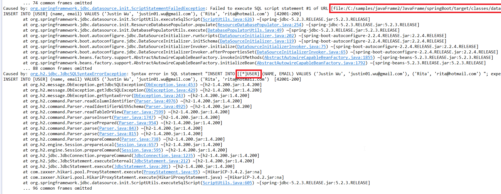
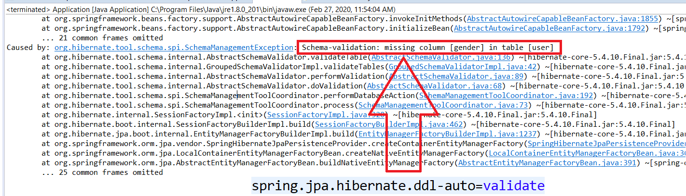

## Learning Spring boot project

### Benefits
+ Easy to start
+ Solve dependency hell

### Drawbacks
- Dependency bound together, hard to adjust
- Dependency Injection makes code static analysis harder, hard to refactor
- hard to get rid of it, fill coupled, bad for long existing application

### Configure
Spring boot can get configure setting from many resources:
- Command line parameters
- JNDI properties
- JVM properties like: --spring.main.show-banner=false
- OS environment variables, like: export spring_main_show_banner=false
- application.properties in config folder of current Jar, like spring.main.show-banner=false
- application.properties in current Jar folder
- application.properties in current Jar
- any text file in @PropertySource
- default value

In this list, the top one override the bottom one if they have the same setting name

#### Server http port
Spring boot used this to set server port:
`server.port=9090'

You can see Spring boot has a bad naming conversion: 
We don't know a setting is Spring boot reserved setting name or just one was created by a developer.  

## Error handling
- Spring boot will stop if it detect any error: 


### Cache
#### template cache
By default, Spring boot will load templates into the memory and ignore all modification. 
It is inconvenient for the developer, So you use this to disable it:
`spring.thymeleaf.cache=false1`

For production, you should never do it.

#### Java code cache
By default, Spring boot will load Java Class into the memory and ignore all Java modification.
It is inconvenient for the developer, So you use this to disable it:
```xml
		<dependency>
			<groupId>org.springframework.boot</groupId>
			<artifactId>spring-boot-devtools</artifactId>
			<scope>runtime</scope>
			<optional>true</optional>
		</dependency>
```

In this way, Spring boot will automatically detect your changing and load them(hot swapping).
For production, you should never do it.

### security
When security is enabled, many inner URL is blocked, we need to set exceptions for those URL. 
But some inner path is hidden in the code, we don't know the URL. 
For example, H2-console is not working properly when security is enabled.

### Run as a service
+ Usually your code is in a war file, and OS administrator already set your web server as a service.
+ But as a SpringBoot, your code itself has container, which make it difficult to set it as a service.
+ To solve this issue, Spring Boot provide war build option with a little code changing: 
    + adding an SpringBootServletInitialize
    + use Profile to design prod only parameters

## JPA
Spring boot will automatically run schema.sql and data.sql in the resources folder when 
- it has spring-boot-starter-data-jpa dependency
- spring.jpa.hibernate.ddl-auto=none in the application.properties

The spring.jpa.hibernate.ddl-auto is special, depending on runtime conditions, it has different defaults:
- If an embedded database is used and no schema manager (such as Liquibase or Flyway) is handling the DataSource, it defaults to create-drop. 
- In all other cases, it defaults to none.

In this project, we used H2 embedded database, so spring boot will:
+ run schema.sql and data.sql firstly, 
+ then re-create those tables from ddl-auto.

This means schema.sql and data.sql won't work by default

To make sure our Code matched the database, we can set to this:
- spring.jpa.hibernate.ddl-auto=validate

### general mapping
Hibernate will automatically find many errors when it is starting. For example:
- it will throw this error if getter didn't match setter:
    `org.hibernate.PropertyNotFoundException: Could not locate setter method for property [abc.validation.domain.Item#price]`

###Enum mapping
- By default, Hibernate maps an enum to a number. It uses the ordinal value.
- You can map the enum value to a String like this way:

```java
  @Enumerated(EnumType.STRING)
  private Rating rating;
```
- You can create a Custom Mapping by implementing AttributeConverter
- You can tell the JPA provider to use your customized enum converter automatically in any entity 

```java
	@Converter(autoApply = true)
```
- please go [here](https://thoughts-on-java.org/hibernate-enum-mappings/) for details. 


